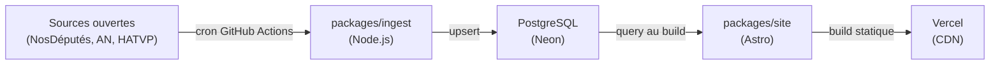

# Architecture

## Vue d'ensemble

Elupedia suit un pipeline linéaire : les données publiques sont collectées périodiquement, stockées en base, puis consommées au moment du build pour générer un site statique.

## Étapes du pipeline

### 1. Ingestion (`packages/ingest`)

Scripts Node.js exécutés via des cron jobs GitHub Actions. Chaque script interroge une API publique (NosDéputés.fr, données ouvertes de l'Assemblée nationale, HATVP) et effectue un upsert en base.

- Exécution : scheduled workflows GitHub Actions
- Fréquence : quotidienne ou hebdomadaire selon la source
- Stratégie : upsert (insert on conflict update) pour l'idempotence

### 2. Base de données (PostgreSQL / Neon)

Base PostgreSQL hébergée sur Neon (serverless). Le schéma est géré par Drizzle ORM et versionné via Drizzle Kit (migrations).

- Tables et colonnes en anglais, snake_case
- Schéma défini dans `packages/shared/src/schema/`
- Migrations dans `drizzle/`
- Client de connexion : `packages/shared/src/db.ts` (lit `DATABASE_URL`)

#### Tables livrées (M0)

| Table                    | Colonnes clés                                                         | FK vers            |
| ------------------------ | --------------------------------------------------------------------- | ------------------ |
| `officials`              | id, first_name, last_name, an_id, birth_date, photo_url               | —                  |
| `mandates`               | type, district, department, start_date, end_date, political_group     | officials          |
| `ballots`                | an_id, title, date, type                                              | —                  |
| `votes`                  | position (for/against/abstain/absent)                                 | ballots, officials |
| `staffers`               | first_name, last_name, start_date, end_date (index sur official_id)   | officials          |
| `affiliations`           | party_or_group, start_date, end_date                                  | officials          |
| `interests`              | type (company_share/nonprofit_role), entity_name, declared_date       | officials          |
| `addresses`              | type (constituency/assembly), street, postal_code, city, phone, email | officials          |
| `external_links`         | platform, url                                                         | officials          |
| `press_mentions`         | title, source_name, source_url, published_date, summary               | officials          |
| `parliamentary_activity` | type, title, date, status                                             | officials          |
| `committees`             | name, type, start_date, end_date                                      | officials          |
| `electoral_results`      | election_type, election_date, round, score_percent, opponent_count    | officials          |

### 3. Build du site (`packages/site`)

Site Astro avec composants React et Tailwind CSS. Les données sont requêtées depuis la base **uniquement au moment du build** (pas de requêtes côté client, pas de SSR).

- Framework : Astro (static output)
- Composants interactifs : React (islands)
- Styling : Tailwind CSS

### 4. Déploiement (Vercel)

Le site statique généré est déployé sur Vercel. Chaque push sur `main` déclenche un rebuild.

- Hébergement : Vercel (CDN mondial)
- Mode : statique uniquement (pas de fonctions serverless)

## Packages partagés (`packages/shared`)

Contient le client DB (Drizzle + Neon), le schéma complet (13 tables), les types TypeScript et les helpers utilisés à la fois par `ingest` et `site`.

## CI / CD

- **GitHub Actions** (`.github/workflows/ci.yml`) : lint, format, typecheck et tests sur chaque PR et push sur `main`
- **Dependabot** (`.github/dependabot.yml`) : surveillance hebdomadaire des dépendances npm

## Tests

- **Framework** : Vitest (configuré à la racine et dans chaque package)
- **Commande** : `yarn test` lance les tests racine puis ceux de chaque workspace
- **Couverture M0** : 149 tests (structure monorepo, configs, schéma DB, migration, CI, documentation)
