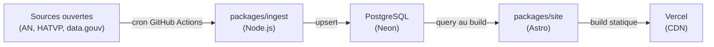

# Architecture

## Vue d'ensemble

Elupedia suit un pipeline linéaire : les données publiques sont collectées périodiquement, stockées en base, puis consommées au moment du build pour générer un site statique.

## Étapes du pipeline

### 1. Ingestion (`packages/ingest`)

Scripts Node.js exécutés via des cron jobs GitHub Actions. Chaque script télécharge des archives ZIP ou des fichiers CSV depuis les portails open data et effectue un upsert en base.

- Exécution : quatre cron GitHub Actions séparés :
  - AN complète (`.github/workflows/ingest-an.yml`, 1er dimanche du mois 21:00 UTC) — ingestion intégrale : députés, collaborateurs, intérêts HATVP, adresses, activité parlementaire, commissions, votes (scrutins)
  - AN partielle (`.github/workflows/ingest-an-partial.yml`, mardi/samedi 02:00 UTC) — activité parlementaire + intérêts HATVP, critérisée : exclut députés décédés, mandats terminés, questions répondues depuis plus de 3 mois, déclarations d'élus inactifs
  - Sénat (`.github/workflows/ingest-senat.yml`, mardi/samedi 03:00 UTC) — sénateurs, votes, affiliations, collaborateurs, adresses, historique électoral
  - Maires (`.github/workflows/ingest-maires.yml`, 1er du mois 04:00 UTC) — maires RNE, adresses DILA, scrape réseaux sociaux communes
  - Presse (`.github/workflows/ingest-press.yml`, lundi 05:00 UTC) — articles de presse via Google News RSS, élus vivants uniquement, délai 3s entre chaque élu
- Déclenchement manuel : `workflow_dispatch` sur chaque workflow
- Stratégie : upsert (insert on conflict update) pour l'idempotence
- Résilience : retry avec backoff exponentiel (3 tentatives, délais 1s/2s/4s) via `utils/retry.ts`
- Orchestration : `run-an.ts` (6 étapes AN), `run-senat.ts` (9 étapes Sénat) et `run-maires.ts` (3 étapes Maires), isole les erreurs par étape et affiche un résumé ; `run-social-links.ts` (crawl AN + scraping sites perso) ; `run.ts` combine AN + Sénat + Maires pour un run complet
- Détection de changement : `utils/change-detector.ts` compare les compteurs created/updated, expose un indicateur `has_changes` en output GitHub Actions
- Points d'entrée : `main-an.ts` (`ingest:an`, 7 étapes), `main-an-partial.ts` (`ingest:an:partial`), `main-senat.ts` (`ingest:senat`), `main-maires.ts` (`ingest:maires`), `main-social-links.ts` (`ingest:social-links`), `main-press.ts` (`ingest:press`), `main.ts` (`ingest`, combiné)

#### Clients de données

| Client                     | Fichier                            | Source                      | Format        | Statut   |
| -------------------------- | ---------------------------------- | --------------------------- | ------------- | -------- |
| Députés (tous)             | `sources/assemblee-nationale.ts`   | data.assemblee-nationale.fr | ZIP/JSON      | ✅ actif |
| Collaborateurs AN          | `sources/an-collaborateurs.ts`     | data.assemblee-nationale.fr | CSV           | ✅ actif |
| Adresses/contacts AN       | `sources/an-adresses.ts`           | data.assemblee-nationale.fr | ZIP/JSON      | ✅ actif |
| Activité parlementaire     | `sources/an-activite.ts`           | data.assemblee-nationale.fr | ZIP/JSON      | ✅ actif |
| Commissions/délégations    | `sources/an-commissions.ts`        | data.assemblee-nationale.fr | ZIP/JSON      | ✅ actif |
| Intérêts (HATVP)           | `sources/hatvp.ts`                 | hatvp.fr                    | XML streaming | ✅ actif |
| Sénateurs                  | `sources/senat.ts`                 | data.senat.fr               | JSON API      | ✅ actif |
| Scrutins Sénat             | `sources/senat-scrutins.ts`        | data.senat.fr               | JSON API      | ✅ actif |
| Groupes Sénat              | `sources/senat-groupes.ts`         | data.senat.fr               | JSON API      | ✅ actif |
| Collaborateurs Sénat       | `sources/senat-collaborateurs.ts`  | data.senat.fr               | JSON API      | ✅ actif |
| Adresses Sénat             | `sources/senat-adresses.ts`        | data.senat.fr               | JSON API      | ✅ actif |
| Historique électoral Sénat | `sources/senat-elections.ts`       | data.senat.fr               | JSON API      | ✅ actif |
| Commissions Sénat          | `sources/senat-commissions.ts`     | data.senat.fr               | JSON API      | ✅ actif |
| Réseaux sociaux Sénat      | `sources/senat-reseaux-sociaux.ts` | senat.fr                    | JSON + HTML   | ✅ actif |
| Scrutins AN                | `sources/an-scrutins.ts`           | data.assemblee-nationale.fr | ZIP/JSON      | ✅ actif |
| Presse (Google News)       | `sources/google-news.ts`           | news.google.com             | RSS/XML       | ✅ actif |
| Maires (RNE)               | `sources/rne-maires.ts`            | data.gouv.fr                | CSV           | ✅ actif |
| Mairies (DILA)             | `sources/dila-mairies.ts`          | service-public.fr           | JSON API      | ✅ actif |
| Résultats électoraux AN    | `sources/datagouv-elections.ts`    | data.gouv.fr                | —             | ⏸ prévu  |

#### Upsert / Diff

| Upsert                     | Fichier                             | Stratégie                              |
| -------------------------- | ----------------------------------- | -------------------------------------- |
| Officials + mandates (AN)  | `upsert/officials.ts`               | Upsert sur an_id                       |
| Sénateurs + mandats        | `upsert/senators.ts`                | Upsert sur an_id (source Sénat)        |
| Votes + ballots (AN)       | `upsert/an-votes.ts`                | Upsert sur ballot_id + official        |
| Votes Sénat                | `upsert/senat-votes.ts`             | Upsert sur ballot_id + official        |
| Collaborateurs AN          | `upsert/staffers-diff.ts`           | Diff (set end_date si parti)           |
| Collaborateurs Sénat       | `upsert/senat-staffers-diff.ts`     | Diff (set end_date si parti)           |
| Affiliations AN            | `upsert/affiliations-diff.ts`       | Diff (set end_date si changé)          |
| Affiliations Sénat         | `upsert/senat-affiliations.ts`      | Upsert sur official + groupe           |
| Intérêts                   | `upsert/interests.ts`               | Upsert sur official + entity           |
| Adresses AN                | `upsert/addresses.ts`               | Upsert sur official + type             |
| Adresses Sénat             | `upsert/senat-addresses.ts`         | Upsert sur official + type             |
| Activité parlementaire     | `upsert/parliamentary-activity.ts`  | Upsert sur official + title + date     |
| Commissions                | `upsert/committees.ts`              | Upsert sur official + name + type      |
| Résultats électoraux AN    | `upsert/electoral-results.ts`       | Upsert sur official + election + round |
| Résultats électoraux Sénat | `upsert/senat-electoral-results.ts` | Upsert sur official + election + round |
| Commissions Sénat          | `upsert/senat-committees.ts`        | Upsert sur official + name + type      |
| Liens sociaux Sénat        | `upsert/senat-social-links.ts`      | Upsert sur official + platform         |
| Maires                     | `upsert/mayors.ts`                  | Upsert sur nom + prénom + naissance    |
| Adresses mairies           | `upsert/mayor-addresses.ts`         | Upsert sur official + town_hall        |
| Scrape réseaux maires      | `upsert/mayor-social-scrape.ts`     | Scrape sites officiels communes        |
| Mentions presse            | `upsert/press-mentions.ts`          | Insert dédupliqué sur official + URL   |

### 2. Base de données (PostgreSQL / Neon)

Base PostgreSQL hébergée sur Neon (serverless). Le schéma est géré par Drizzle ORM et versionné via Drizzle Kit (migrations).

- Tables et colonnes en anglais, snake_case
- Schéma défini dans `packages/shared/src/schema/`
- Migrations dans `drizzle/`
- Client de connexion : `packages/shared/src/db.ts` (lit `DATABASE_URL`)

#### Tables (M0 — schéma)

| Table                    | Colonnes clés                                                                                                                                                      | FK vers            |
| ------------------------ | ------------------------------------------------------------------------------------------------------------------------------------------------------------------ | ------------------ |
| `officials`              | id, first_name, last_name, an_id, slug (permalink unique), birth_date, death_date, photo_url                                                                       | —                  |
| `mandates`               | type, district, department, start_date, end_date, political_group, commune_code, parent_commune_code                                                               | officials          |
| `ballots`                | an_id, title, date, type                                                                                                                                           | —                  |
| `votes`                  | position (for/against/abstain/absent)                                                                                                                              | ballots, officials |
| `staffers`               | first_name, last_name, start_date, end_date (index sur official_id)                                                                                                | officials          |
| `affiliations`           | party_or_group, start_date, end_date                                                                                                                               | officials          |
| `interests`              | type (professional_activity/consulting_activity/governing_body_membership/voluntary_activity/elected_function/financial_participation), entity_name, declared_date | officials          |
| `addresses`              | type (constituency/assembly), street, postal_code, city, phone, email                                                                                              | officials          |
| `external_links`         | platform, url                                                                                                                                                      | officials          |
| `press_mentions`         | title, source_name, source_url, published_date, summary                                                                                                            | officials          |
| `parliamentary_activity` | type, title, date, status, question_text, response_text, response_date, government_comments, source_url, rubrique, tete_analyse, question_number                   | officials          |
| `committees`             | name, type, start_date, end_date                                                                                                                                   | officials          |
| `electoral_results`      | election_type, election_date, round, score_percent, opponent_count                                                                                                 | officials          |

### 3. Build du site (`packages/site`)

Site Astro avec composants React et Tailwind CSS. Les données sont requêtées depuis la base **uniquement au moment du build** (pas de requêtes côté client, pas de SSR).

- Framework : Astro 7 (static output)
- Composants interactifs : React 19 (islands via `@astrojs/react`)
- Styling : Tailwind CSS 4 (via `@tailwindcss/vite`)
- Utilitaires date : date-fns (calcul d'âge sur la fiche élu)
- Layout de base : `src/layouts/BaseLayout.astro` (header, footer, meta description, titre dynamique)
- SEO : sitemap XML généré au build (`@astrojs/sitemap`), meta tags Open Graph (title, description, image, url, type, locale, site_name), URL canonique. JSON-LD schema.org sur toutes les pages : WebSite+Organization (BaseLayout), BreadcrumbList (annuaire, votes, fiche élu, fiche scrutin), ItemList (annuaire élus, listing votes), Person avec sameAs/worksFor/memberOf/address (fiche élu), VoteAction (fiche scrutin)
- Site URL : `https://elupedia.fr`
- Consentement cookies : tarteaucitron.js vendorisé dans `public/tarteaucitron/`, conforme CNIL (highPrivacy, DenyAllCta, AcceptAllCta)
- Composants React : `src/components/OfficialsList.tsx` (grille d'accueil avec filtres), `src/components/QuestionDetailDrawer.tsx` (tiroir de détail d'une question)
- Accessibilité : skip-to-content, focus-visible global, aria-label sur la navigation, contraste WCAG AA (minimum text-gray-500 pour le texte informatif)
- Pages :
  - `src/pages/index.astro` — page d'accueil (grille de cartes des élus avec photo, badge député/sénateur genré, nom, circonscription, groupe politique ; filtres par type de mandat et département)
  - `src/pages/elus/[slug].astro` — fiche détaillée d'un élu, routée par slug permalink (`/elus/manuel-bompard`), avec fallback sur UUID si slug absent. Sections : identité avec âge calculé, mandat en cours, tous les mandats, coordonnées, affiliations, collaborateurs, activité parlementaire, commissions & groupes, historique électoral, intérêts déclarés groupés par catégorie, votes (avec lien vers page scrutin), presse (grille de cards Google News), liens extérieurs, indicateur de dernière mise à jour, modales de provenance AN pour les sections mandat/coordonnées/liens des députés
  - `src/pages/scrutins/[id].astro` — détail d'un scrutin (titre, date, type, barre de synthèse, filtres par position et groupe politique, grille de cartes députés avec photo et badge de position). SEO : JSON-LD VoteAction + BreadcrumbList, og:type article, meta description avec décompte des votes
  - `src/pages/a-propos.astro` — page À propos (présentation, feuille de route, piliers, indépendance, contribution)
  - `src/pages/donnees-personnelles.astro` — page droits RGPD (données publiées, base légale, droits, contact, CNIL, cookies)
  - `src/pages/mentions-legales.astro` — mentions légales (sources de données, licences, hébergeur, licence code AGPL-3.0)

### 4. Déploiement (Vercel)

Le site statique généré est déployé sur Vercel. Chaque push sur `main` déclenche un rebuild.

- Hébergement : Vercel (CDN mondial)
- Mode : statique uniquement (pas de fonctions serverless)
- Configuration : `vercel.json` — `installCommand` active corepack pour Yarn 4, `buildCommand` lance `drizzle-kit migrate` puis `astro build` depuis `packages/site`, output dans `packages/site/dist`
- Domaine : `elupedia.fr` (DNS configuré vers Vercel)
- Variables d'environnement : `DATABASE_URL` configurée sur Vercel pour le build
- Analytics : Vercel Web Analytics (`@vercel/analytics`, cookieless, injecté dans le layout)
- Chaîne ingestion → rebuild : chaque workflow d'ingestion (AN, Sénat) expose `has_changes`, qui conditionne un rebuild Vercel via deploy hook

## Packages partagés (`packages/shared`)

Contient le client DB (Drizzle + Neon), le schéma complet, les types TypeScript et les helpers utilisés à la fois par `ingest` et `site`.

## Documentation et conformité

- **README.md** : présentation du projet, stack, sources de données, instructions de setup, contribution, badge CI
- **LICENSE** : texte complet AGPL-3.0
- **docs/DATA-LICENSES.md** : inventaire des sources de données et leurs licences de réutilisation
- **docs/ARCHITECTURE.md** : ce fichier
- **docs/DOMAINS.md** : domaines métier et sources associées

## CI / CD

- **GitHub Actions CI** (`.github/workflows/ci.yml`) : lint, format, typecheck et tests sur chaque PR et push sur `main`
- **GitHub Actions Ingestion AN — complète** (`.github/workflows/ingest-an.yml`) : 1er dimanche du mois 21:00 UTC, pipeline AN intégral
- **GitHub Actions Ingestion AN — partielle** (`.github/workflows/ingest-an-partial.yml`) : mardi/samedi 02:00 UTC, activité parlementaire + HATVP avec critérisation (exclut décédés, mandats terminés, Q/R anciennes, déclarations inactifs)
- **GitHub Actions Ingestion Sénat** (`.github/workflows/ingest-senat.yml`) : mardi/samedi 03:00 UTC, pipeline Sénat
- **GitHub Actions Ingestion Maires** (`.github/workflows/ingest-maires.yml`) : 1er du mois 04:00 UTC, pipeline Maires (RNE + DILA + scrape communes)
- **GitHub Actions Ingestion liens sociaux** (`.github/workflows/ingest-social-links.yml`) : quotidien 03:30 UTC, crawl des 2 pages AN (réseaux sociaux + sites personnels) + scraping de 50 sites perso/jour pour détection Instagram/TikTok/YouTube
- **GitHub Actions Social Daily Post** (`.github/workflows/social-daily-post.yml`) : deux publications quotidiennes sur les réseaux sociaux via Postiz — matin 08:30 Paris (élu aléatoire), soir 18:30 Paris (vote récent) ; déclenchement manuel avec choix du mode
- **Dependabot** (`.github/dependabot.yml`) : surveillance hebdomadaire des dépendances npm

## Tests

- **Framework** : Vitest (configuré à la racine et dans chaque package)
- **Commande** : `yarn test` lance les tests racine puis ceux de chaque workspace
- **Couverture M7** : structure monorepo, configs, schéma DB, migration, CI, clients API (ZIP/JSON et CSV), upsert/diff, retry, orchestration, cron workflow, change detection, layout, tarteaucitron, SEO, Vercel Web Analytics, page d'accueil, fiche élu avec 14 sections et âge calculé, page scrutin, page à propos, page RGPD, page mentions légales, accessibilité, README, DATA-LICENSES
