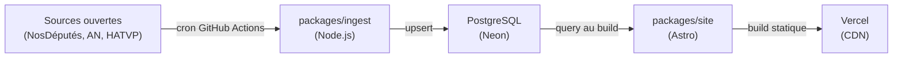

# Architecture

## Vue d'ensemble

Elupedia suit un pipeline linéaire : les données publiques sont collectées périodiquement, stockées en base, puis consommées au moment du build pour générer un site statique.

## Étapes du pipeline

### 1. Ingestion (`packages/ingest`)

Scripts Node.js exécutés via des cron jobs GitHub Actions. Chaque script interroge une API publique (NosDéputés.fr, données ouvertes de l'Assemblée nationale, HATVP, data.gouv.fr) et effectue un upsert en base.

- Exécution : cron GitHub Actions quotidien (`.github/workflows/ingest.yml`, 04:00 heure de Paris)
- Déclenchement manuel : `workflow_dispatch`
- Stratégie : upsert (insert on conflict update) pour l'idempotence
- Résilience : retry avec backoff exponentiel (3 tentatives, délais 1s/2s/4s) via `utils/retry.ts`
- Orchestration : `run.ts` exécute les 9 étapes séquentiellement, isole les erreurs par étape et affiche un résumé
- Détection de changement : `utils/change-detector.ts` compare les compteurs created/updated, expose un indicateur `has_changes` en output GitHub Actions et écrit `ingest-report.json`
- Point d'entrée : `src/main.ts` → script `yarn workspace @elupedia/ingest ingest`

#### Clients API (M1)

| Client                  | Fichier                              | Source API                  |
| ----------------------- | ------------------------------------ | --------------------------- |
| Députés Gironde         | `sources/nosdeputes.ts`              | nosdeputes.fr               |
| Votes par député        | `sources/nosdeputes-votes.ts`        | nosdeputes.fr               |
| Affiliations            | `sources/nosdeputes-affiliations.ts` | nosdeputes.fr               |
| Collaborateurs          | `sources/an-collaborateurs.ts`       | data.assemblee-nationale.fr |
| Adresses/contacts       | `sources/an-adresses.ts`             | data.assemblee-nationale.fr |
| Activité parlementaire  | `sources/an-activite.ts`             | data.assemblee-nationale.fr |
| Commissions/délégations | `sources/an-commissions.ts`          | data.assemblee-nationale.fr |
| Intérêts (HATVP)        | `sources/hatvp.ts`                   | hatvp.fr                    |
| Résultats électoraux    | `sources/datagouv-elections.ts`      | data.gouv.fr                |

#### Upsert / Diff (M1)

| Upsert                 | Fichier                            | Stratégie                              |
| ---------------------- | ---------------------------------- | -------------------------------------- |
| Officials + mandates   | `upsert/officials.ts`              | Upsert sur an_id                       |
| Votes + ballots        | `upsert/votes.ts`                  | Upsert sur ballot_id + official        |
| Collaborateurs         | `upsert/staffers-diff.ts`          | Diff (set end_date si parti)           |
| Affiliations           | `upsert/affiliations-diff.ts`      | Diff (set end_date si changé)          |
| Intérêts               | `upsert/interests.ts`              | Upsert sur official + entity           |
| Adresses               | `upsert/addresses.ts`              | Upsert sur official + type             |
| Activité parlementaire | `upsert/parliamentary-activity.ts` | Upsert sur official + title + date     |
| Commissions            | `upsert/committees.ts`             | Upsert sur official + name + type      |
| Résultats électoraux   | `upsert/electoral-results.ts`      | Upsert sur official + election + round |

### 2. Base de données (PostgreSQL / Neon)

Base PostgreSQL hébergée sur Neon (serverless). Le schéma est géré par Drizzle ORM et versionné via Drizzle Kit (migrations).

- Tables et colonnes en anglais, snake_case
- Schéma défini dans `packages/shared/src/schema/`
- Migrations dans `drizzle/`
- Client de connexion : `packages/shared/src/db.ts` (lit `DATABASE_URL`)

#### Tables (M0 — schéma)

| Table                    | Colonnes clés                                                         | FK vers            |
| ------------------------ | --------------------------------------------------------------------- | ------------------ |
| `officials`              | id, first_name, last_name, an_id, birth_date, photo_url               | —                  |
| `mandates`               | type, district, department, start_date, end_date, political_group     | officials          |
| `ballots`                | an_id, title, date, type                                              | —                  |
| `votes`                  | position (for/against/abstain/absent)                                 | ballots, officials |
| `staffers`               | first_name, last_name, start_date, end_date (index sur official_id)   | officials          |
| `affiliations`           | party_or_group, start_date, end_date                                  | officials          |
| `interests`              | type (company_share/nonprofit_role), entity_name, declared_date       | officials          |
| `addresses`              | type (constituency/assembly), street, postal_code, city, phone, email | officials          |
| `external_links`         | platform, url                                                         | officials          |
| `press_mentions`         | title, source_name, source_url, published_date, summary               | officials          |
| `parliamentary_activity` | type, title, date, status                                             | officials          |
| `committees`             | name, type, start_date, end_date                                      | officials          |
| `electoral_results`      | election_type, election_date, round, score_percent, opponent_count    | officials          |

### 3. Build du site (`packages/site`)

Site Astro avec composants React et Tailwind CSS. Les données sont requêtées depuis la base **uniquement au moment du build** (pas de requêtes côté client, pas de SSR).

- Framework : Astro (static output)
- Composants interactifs : React (islands)
- Styling : Tailwind CSS

### 4. Déploiement (Vercel)

Le site statique généré est déployé sur Vercel. Chaque push sur `main` déclenche un rebuild.

- Hébergement : Vercel (CDN mondial)
- Mode : statique uniquement (pas de fonctions serverless)

## Packages partagés (`packages/shared`)

Contient le client DB (Drizzle + Neon), le schéma complet (13 tables), les types TypeScript et les helpers utilisés à la fois par `ingest` et `site`.

## CI / CD

- **GitHub Actions CI** (`.github/workflows/ci.yml`) : lint, format, typecheck et tests sur chaque PR et push sur `main`
- **GitHub Actions Ingestion** (`.github/workflows/ingest.yml`) : cron quotidien 02:00 UTC, lance le pipeline d'ingestion complet, expose `has_changes` pour conditionner un rebuild du site
- **Dependabot** (`.github/dependabot.yml`) : surveillance hebdomadaire des dépendances npm

## Tests

- **Framework** : Vitest (configuré à la racine et dans chaque package)
- **Commande** : `yarn test` lance les tests racine puis ceux de chaque workspace
- **Couverture M2** : ~295 tests (structure monorepo, configs, schéma DB, migration, CI, clients API, upsert/diff, retry, orchestration, cron workflow, change detection)
