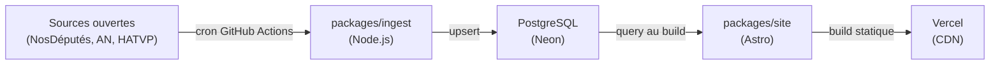

# Architecture

## Vue d'ensemble

Elupedia suit un pipeline linéaire : les données publiques sont collectées périodiquement, stockées en base, puis consommées au moment du build pour générer un site statique.

## Étapes du pipeline

### 1. Ingestion (`packages/ingest`)

Scripts Node.js exécutés via des cron jobs GitHub Actions. Chaque script interroge une API publique (NosDéputés.fr, données ouvertes de l'Assemblée nationale, HATVP) et effectue un upsert en base.

- Exécution : scheduled workflows GitHub Actions
- Fréquence : quotidienne ou hebdomadaire selon la source
- Stratégie : upsert (insert on conflict update) pour l'idempotence

### 2. Base de données (PostgreSQL / Neon)

Base PostgreSQL hébergée sur Neon (serverless). Le schéma est géré par Drizzle ORM et versionné via Drizzle Kit (migrations).

- Tables et colonnes en anglais, snake_case
- Schéma défini dans `packages/shared`

### 3. Build du site (`packages/site`)

Site Astro avec composants React et Tailwind CSS. Les données sont requêtées depuis la base **uniquement au moment du build** (pas de requêtes côté client, pas de SSR).

- Framework : Astro (static output)
- Composants interactifs : React (islands)
- Styling : Tailwind CSS

### 4. Déploiement (Vercel)

Le site statique généré est déployé sur Vercel. Chaque push sur `main` déclenche un rebuild.

- Hébergement : Vercel (CDN mondial)
- Mode : statique uniquement (pas de fonctions serverless)

## Packages partagés (`packages/shared`)

Contient les types TypeScript, le schéma Drizzle et les helpers utilisés à la fois par `ingest` et `site`.
